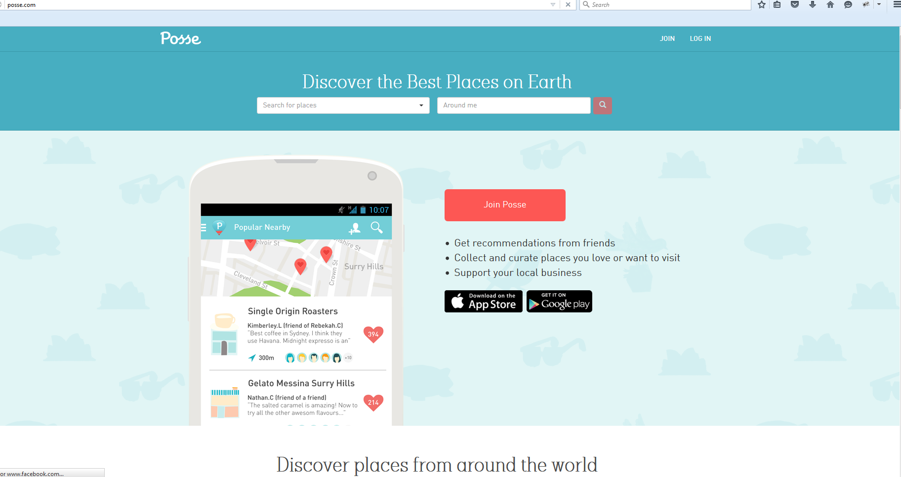
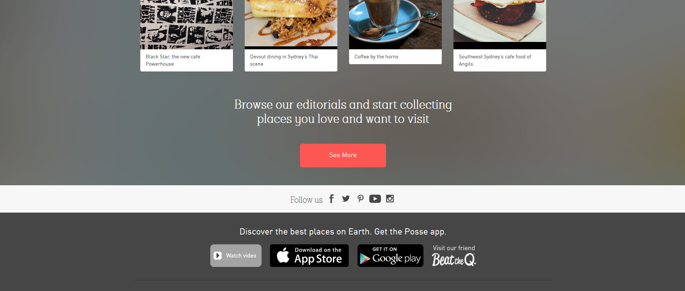

# posse.com

This is a website for tuorists with a tirp.

# Technology Used.

1. framework: Node.js(express.js)
2. front end script: Angular.js, ejs, html5, css3, bootstrap
3. main gem: passport, stripe, mailchimp, morgan, passport-facebook, passport-twitter, passport-google-oauth, redis, swig, csvtojson, gulp, nodemailer, grunt, bower,  karma-cli, jsonwebtoken
4. parse api.
5. main feature: 
>1. User authentication  with jwt, Social login.
>2. Payment integration using Stripe API.
>3. AWS S3 - file uploading.
>4. Geoloation integration.
>5. Social Media integration.(Facebook, Twitter, Pinterest)
>5. Hybrid mobile application development using Ionic+Angular
>6. RESTful API for mobile app back end point.

6. hosting: AWS EC2 using Amazon marketing place

# Portfolio

